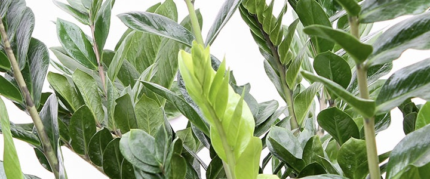

import { Descriptions } from 'antd';

# Pflanzen

## Zamioculcas

<Descriptions column={2}>
  <Descriptions.Item label="Gießen">wenig Wasser</Descriptions.Item>
  <Descriptions.Item label="Temperatur">
    Tagsüber 12, Nachts 5 Grad
  </Descriptions.Item>
  <Descriptions.Item label="Licht">Wenig Licht</Descriptions.Item>
  <Descriptions.Item label="Düngen">Frühling, Sommer</Descriptions.Item>
  <Descriptions.Item label="Umtopfen">1-3 Jahre</Descriptions.Item>
</Descriptions>

### Gießen

<https://fubar.de>

Die Zamioculcas braucht nicht viel Wasser, wenn die Zamioculcas zuviel Wasser bekommt haben Sie die Chance das die unteren Blätter gelb werden.
Im Winter können Sie die Zamioculcas ruhig zwei bis vier Wochen mit trockener Erde stehen lassen.
Im Sommer sollte das nur 1 Woche sein.
Beim gießen ist es wichtig die Erde erst richtig trocknen zu lassen bevor Sie wieder gießen.

### Licht & Temperatur

Die Zamioculcas braucht nicht viel Lichtintensität. Eine helle Stelle würde gehen aber passen Sie am Anfang auf, dass die Zamioculcas nicht zuviel direktes Sonnenlicht hat. Die Pflanze ist gezüchtet in filtriertes Licht und deshalb nicht gewöhnt an direktes Licht. Regelmäßig drehen wird die Pflanze helfen schön gleichmäßig zu wachsen. Sie können die Zamioculcas immer naher zum Fenster bewegen.

Die beste Stelle für die Zamioculcas ist bij ein Ost- und West Fenster 2 bis 3 Meter vom Fenster, bei ein Südfenster kann das 3 bis 4 Meter sein. Bei einem Nordfenster sollten Sie die Zamioculcas direkt am Fester hinstellen.

Im Frühling und Sommer können Sie die Pflanze auch draußen hinstellen. Dabei Sollten Sie aber wieder darauf achten dass die Pflanze nicht gleich in direktes Sonnenlicht hingestellt wird. Die Mittagssonne sollten Sie am besten vermeiden.

### Umtopfen

Gleich nach dem Kauf können Sie die Zamioculcas umtopfen oder im Frühling. Die Frühling hat aber den Präferenz weil eventual beschädigten Würzel sich dann besser erholen. Die Zamioculcas sollten Sie 1 mal pro 3 Jahre umtopfen.

Diese Zimmerpflanze braucht einen Pflanzgefäße die mindestens 20% großer ist wie der alten Topf, Universal Pflanzerde ist gut geeignet für die Zamioculcas. Unter im Topf sollten Sie kein Blähton benutzen weil dann Wasser stehen bleiben kann, dass kann leiten zu Wurzelfäule. Um die Erde besser zu entwässern können Sie aber 10% Blähton durch die Pflanzenerde mischen.

Je großer den Pflanzgefäße, desto besser die Zamioculcas wachst und es fördert die Gesundheit. Dabei kann ein großeren topf mehr Wasser behalten und brauchen Sie nicht so oft zu gießen.

### Düngen

Die Zamioculcas wächst relativ schnell, deshalb braucht er auch dünger. Im Frühling und Sommer können Sie düngen aber im Winter Sollten Sie dass nicht machen, weil dass die Pflanze schadet. Die Hälfte von die Menge die auf die Packung steht sollte reichen.
